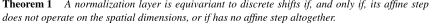
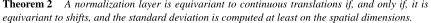
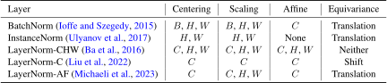
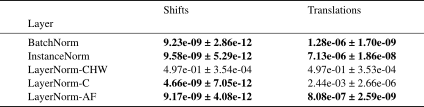
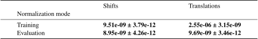

# Translation-Equivariance of Normalization Layers and Aliasing in Convolutional Neural Networks

**Abstract**

The design of convolutional neural architectures that are exactly equivariant to continuous transla-
tions is an active field of research. It promises to benefit scientific computing, notably by making
existing imaging systems more physically accurate. Most efforts focus on the design of downsam-
pling/pooling layers, upsampling layers and activation functions, but little attention is dedicated to
normalization layers. In this work, we present a novel theoretical framework for understanding the
equivariance of normalization layers to discrete shifts and continuous translations. We also deter-
mine necessary and sufficient conditions for normalization layers to be equivariant in terms of the
dimensions they operate on. Using real feature maps from ResNet-18 and ImageNet, we test those
theoretical results empirically and find that they are consistent with our predictions.

**Results**

<p align="center">
    
</p>

<p align="center">
  
</p>

<p align="center">
  
</p>

<p align="center">
  
</p>

<p align="center">
  
</p>

**Reproducing: Computing the errors**

Manually

```bash
python main.py --data_root "datasets/ImageNet" --out "results.csv" --batch_size 1024 
```

Using slurm

```bash
python submit_job.py
```

**Reproducing: Computing the tables**

```bash
jupyter nbconvert --to notebook --execute --inplace notebook.ipynb
```

**Citation**

```
@misc{scanvic2025translationEquivariance,
      title={Translation-Equivariance of Normalization Layers and Aliasing in Convolutional Neural Networks}, 
      author={Jérémy Scanvic and Quentin Barthélemy and Julián Tachella},
      year={2025},
      eprint={2505.19805},
      archivePrefix={arXiv},
      primaryClass={cs.CV},
      url={https://arxiv.org/abs/2505.19805}, 
}
```
